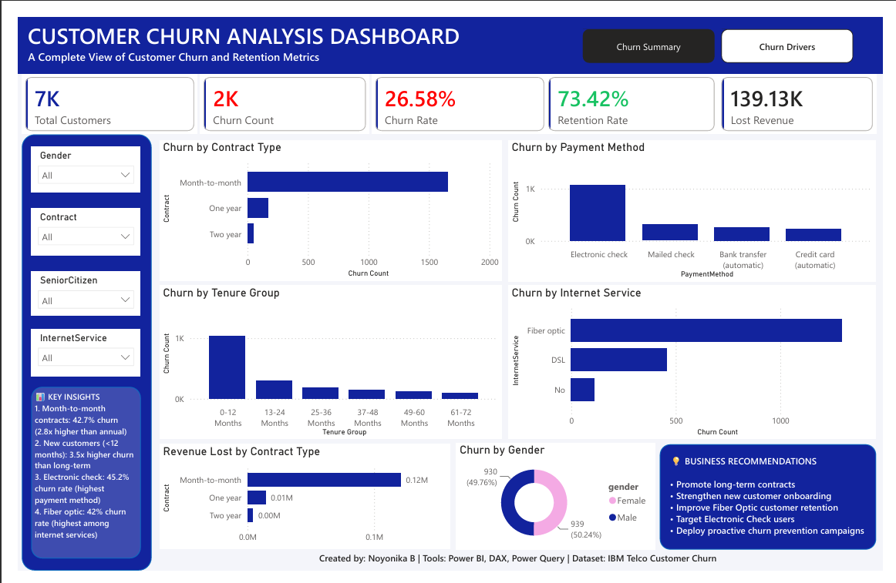
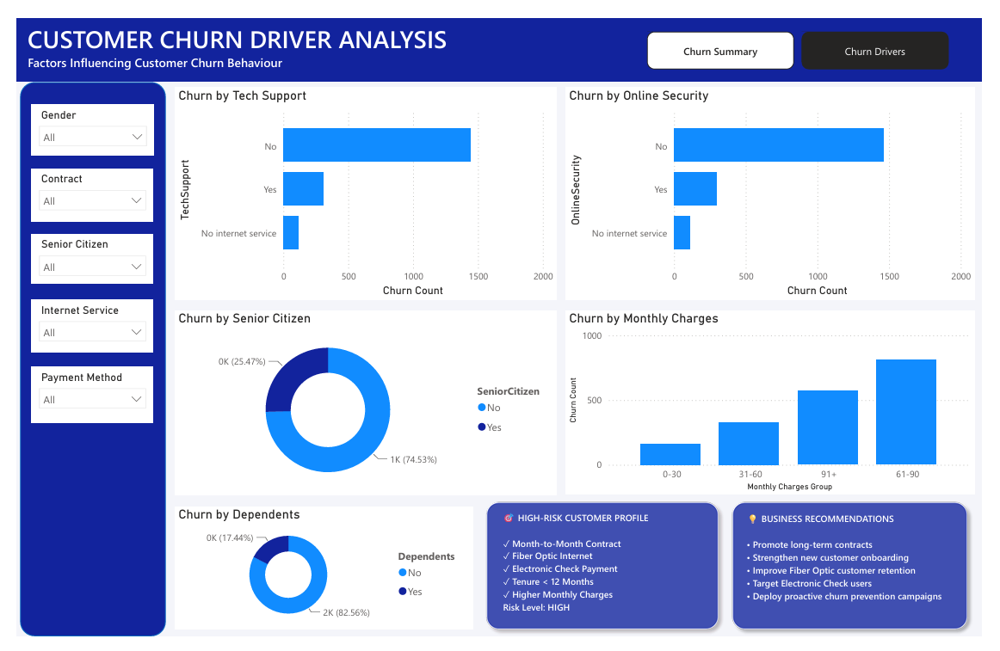

# Customer Churn Analysis Dashboard

## Project Overview

This Power BI dashboard analyzes customer churn patterns and identifies key factors influencing customer retention.

## Tools Used

- Power BI
- DAX
- Power Query
- Excel

## Key Metrics

- Total Customers
- Churn Count
- Churn Rate
- Retention Rate
- Revenue Lost

## Dashboard Pages

### 1. Churn Summary

- Customer KPIs
- Churn by Contract Type
- Churn by Payment Method
- Churn by Tenure Group
- Churn by Internet Service
- Revenue Lost Analysis

### 2. Churn Driver Analysis

- Churn by Tech Support
- Churn by Online Security
- Churn by Senior Citizen
- Churn by Monthly Charges
- High-Risk Customer Profile
- Business Recommendations

## Key Insights

- Month-to-Month customers show the highest churn.
- Fiber Optic customers have elevated churn rates.
- Electronic Check users are more likely to churn.
- New customers (<12 months tenure) are at higher risk.

## Screenshots

### Churn Summary

### Churn Driver Analysis

## Business Recommendations

- Promote long-term contracts.
- Improve onboarding for new customers.
- Strengthen Fiber Optic customer retention.
- Target Electronic Check users with retention campaigns.
